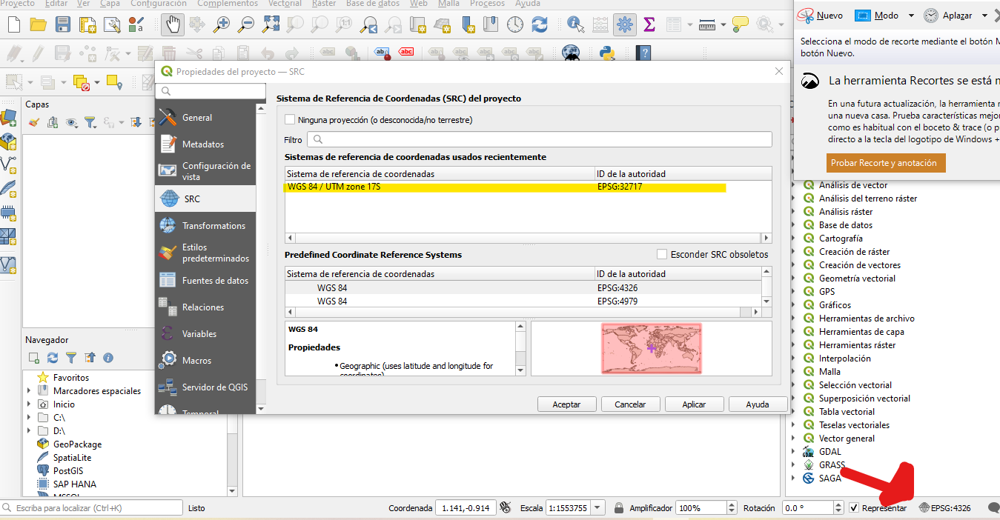
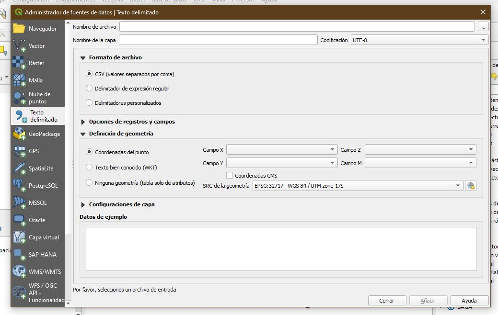
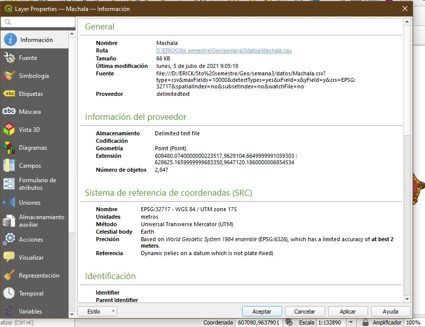
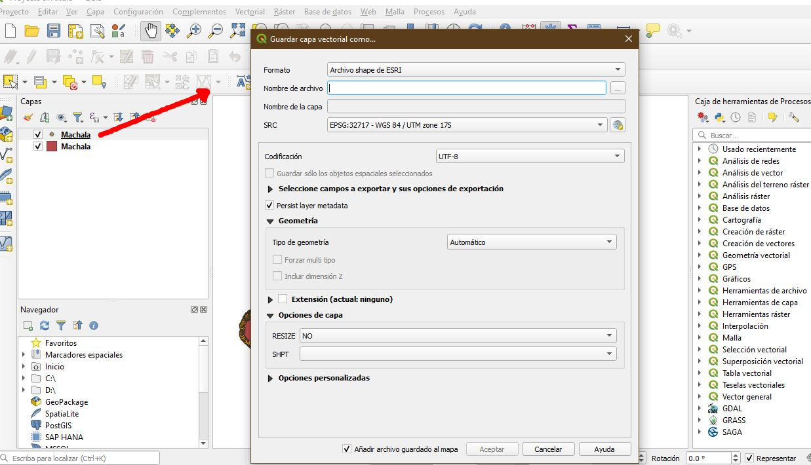
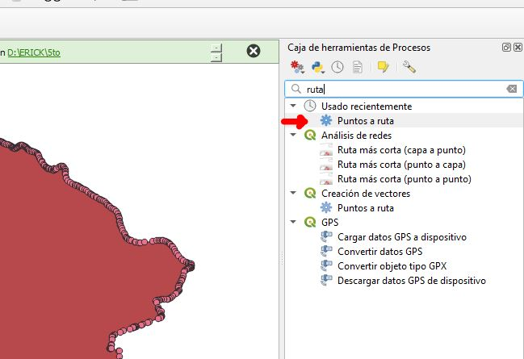
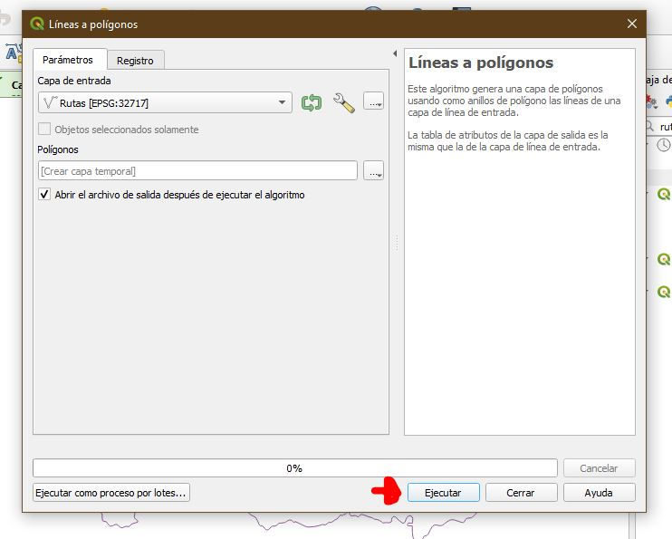
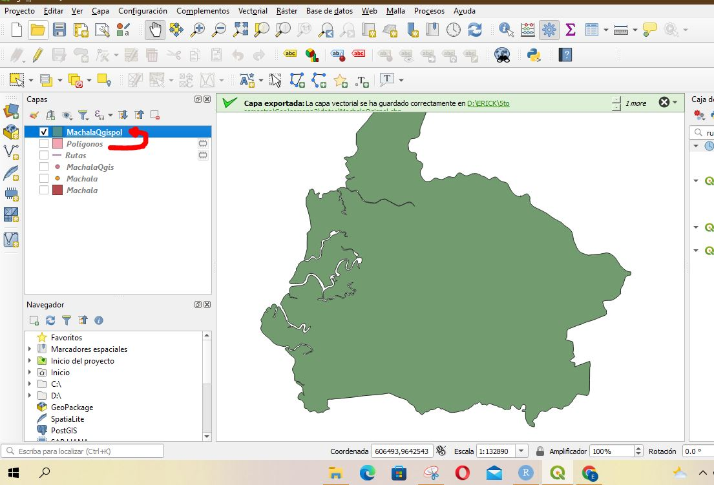
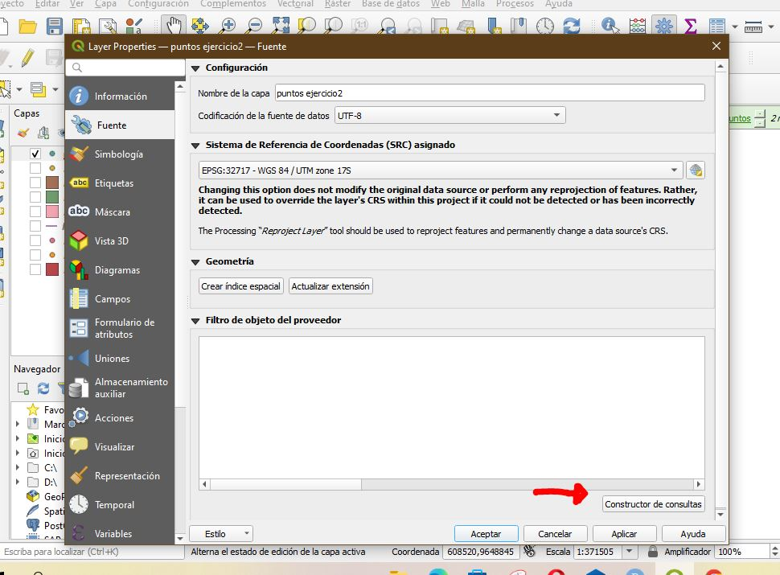
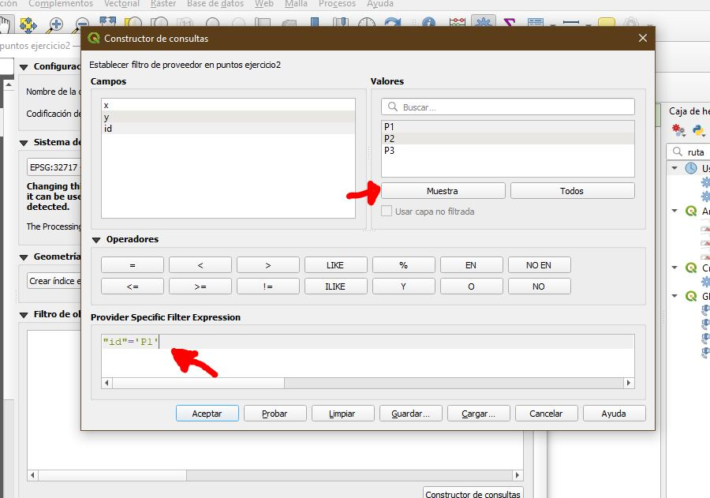

<center>

{height=75px}


**Universidad Técnica de Machala**

**Facultad de Ciencias Agropecuarias**

**Carrera de Agronomía**

**Geomática**


</center>

1. **Datos Informativos**

    **Docente:** Ing. Agr. Angel Eduardo Luna Romero

    **Semana:** 5

    **Fecha:** Pasaje, 23 de Junio 2022
```{r}
setwd("C:/Users/Eirck/Desktop/diarios/")
library(pacman)
p_load( sf, sp,raster, rgdal, tidyverse, rgeos)
```


#####objeto espacial = 1 Geometria ,3 atributos( dataframe),
#2 sistema de referencia de coordenadas(crs)

# Crear geometria de objeto espacial --------------------------------------

#si no queremos que aparezca
#mch <- suppressMessages(read_csv("Machala.csv"))

```{r}

mch <- read_csv("Machala.csv") %>% 
  as.matrix()
```

#crear un poligono

```{r}
mchsf <- st_polygon(list(mch))
class(mchsf)
plot(mchsf)
```


# Adicionar el crs al objeto espacial -------------------------------------

```{r}
mchsf <- st_sfc(mchsf, crs = 32717)
```


#libreria sf es una libreria mas actual, tienen normativas estandarizadas 
# en estadisticasiempre manejamos tablas
# cuando filtramos, movemos, sf nos deja manejar el dato espacial como 
#una tabla normal


# Adicionar los atributos (tabla de atributos) ----------------------------

```{r}
df <- data.frame(Canton= "Machala", codigo = 07)
mchsf <- st_sf(df, mchsf)
```


# cuando vamos a registrar datos 

#guardar archivo
```{r}
st_write(mchsf, "Machala.shp", delete_layer = T)
```


# desarrollo tarea --------------------------------------------------------

#carfar archivos de machala, pea?a, pasaje y la victoria

#mch <- mch[-1]


```{r}
mch <- read_csv("Machala.csv") %>% 
  as.matrix()
pea<- read_csv("LaPeanha.csv") %>% 
  as.matrix()
psj <- read_csv("Pasaje.csv") %>% 
  as.matrix()
vct<- read_csv("Victoria.csv") %>% 
  as.matrix()
```


#crear multipoligonos poligonos

```{r}

mlt <- st_multipolygon(list(list(mch),list(pea),list(psj),
                            list(vct)))
plot(mlt)
```

#para ver si cierra el oligono
#head.matrix(mch,2)
#tail.matrix(mch,2)


#sitema de referencia

```{r}
mlt <- st_sfc(mlt,crs = 32717)

df <- data.frame(Provincia ="EL ORO",Canton = c("Machala", 
                                                rep ("Pasaje",2),
                                                "Santa Rosa"),
                 Parroquia= c("Machala","La Pea?a", "Pasaje","La Victoria"))

mlt <- st_sf(df, mlt)
st_write(mlt, "C:/Users/Eirck/Desktop/diarios/Fer9819.github.iomlt.shp", delete_layer = T)
```


# Cargar puntos y pasarlos a objeto espacial-------------------------------


```{r}
pts <- read_csv("Puntos.csv")
pts$id <- paste0("P",1:3)
ptsf <- st_as_sf(pts, coords = c("x", "y"), crs = 32717)
```


#Geoproceso buffer

```{r}
bf10k <- st_buffer(ptsf %>% 
                     filter(id=="P1"),dist = 10000)
plot(st_geometry(bf10k))
```


# QGIS-----------------------------------------------------------------------
 
 Primero procedemos a cambiar el sistema de referencia de coordenadas
 en EPSG:32717.
 

{height=500px}


Procedemos añadir nuestra capa en formato shape de  ESRI


{height=500px}
Podemos observar el shape


{height=500px}


Procedemos a ir en capa, en la opción de administrador de fuente de datos


{height=500px}


Seleccionamos texto delimitado, para subir nuestro archivo .csv


{height=500px}


Podemos observar nuestro archi delimitado por puntos


{height=500px}


Observamos en información, como nuestro archivo esta delimitado

{height=500px}


Exportamos y lo guardamos en fomato shape


{height=500px}

{height=500px}

{height=500px}


Procedemos a ir a caja de herremientas de procesos y en la opción de buscar
escribimos Puntos a ruta

{height=500px}

Doble click y sellecionamos el archivo que exportamos

{height=500px}

Podemos observar, que se formo una linea que estan sobreto todos los puntos

{height=500px}


Cambiamos el formato de lineas a polígono

{height=500px}

ejecutamos


{height=500px}

Procedemos abrir la tabal de atributos y editamos


{height=500px}

Cambiamos un archivo temporal a un shape 

{height=500px}

Procedemos a editar la tabla de atributos, para luego añadir un nuevo campo, en texto, el cual vamos a ubicar los 3 puntos


{height=500px}

{height=500px}

{height=500px}


{height=500px}


Procedemos a realizar la zona buffer

{height=500px}

Zona buffer realizada

{height=500px}


