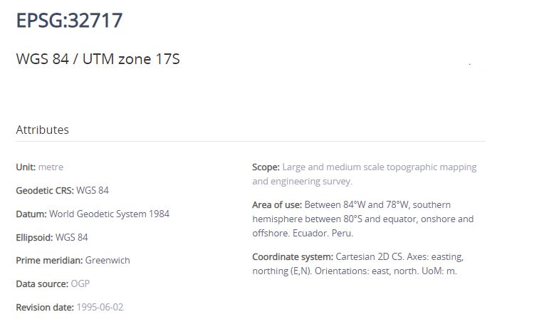
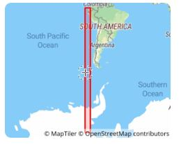
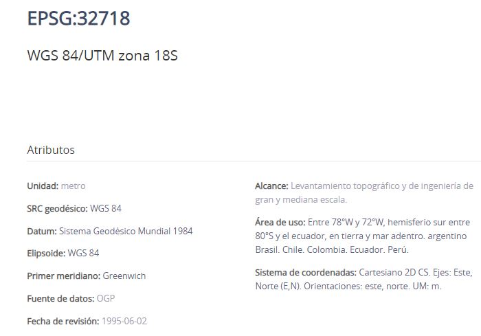
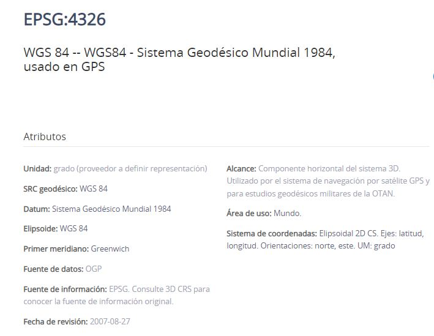
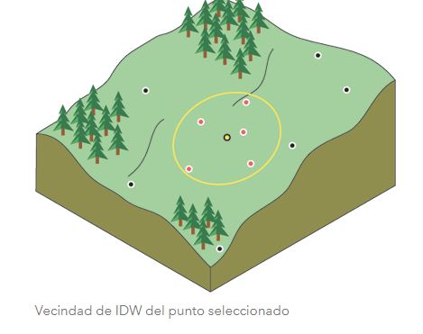

{height=75px}

**Universidad Técnica de Machala**

**Facultad de Ciencias Agropecuarias**

**Carrera de Agronomía**

**Geomática**

 **Glosario Primer hemiciclo**

1. **Datos Informativos**

    **Docente:** Ing. Agr. Angel Eduardo Luna Romero
    
**ESRI**

En 1969, cofundaron Esri, conocido entonces como Environmental Systems Research Institute, Inc. (ESRI), en su ciudad natal de Redlands, California,Esri se centró inicialmente en realizar estudios ambientales para proyectos de ordenamiento territorial, algunas de las primeras herramientas para la digitalización de mapas, la creación de mapas por computadora y el análisis espacial, así como el primer sistema comercial de información geográfica (GIS). La innovación continua, la inversión en investigación y desarrollo y una filosofía genuinamente centrada en el cliente ayudaron a Esri a convertirse en el líder mundial en software GIS, ahora una herramienta esencial en los sectores privado y público .
Fuente(https://www.esri.com/en-us/about/about-esri/company)

**EPSG**

EPSG.io ( http://epsg.io/ ) simplifica el descubrimiento de sistemas de referencia de coordenadas utilizados en todo el mundo para crear mapas y datos geográficos y para identificar la posición geográfica. Es una herramienta práctica para cualquier persona interesada en la cartografía y la elaboración de mapas digitales, que necesite conocer los valores exactos de latitud y longitud de las coordenadas numéricas en diferentes sistemas de referencia espacial. La aplicación de mapas incluida permite mostrar la ubicación precisa en cualquier parte del planeta
Fuente(https://epsg.io/about)

{height=500px}
Fuente(http://epsg.io/)

{height=200px}

Fuente(http://epsg.io/)

{height=500px}

Fuente(http://epsg.io/)

{height=200px}

Fuente(http://epsg.io/)

{height=500px}

Fuente(http://epsg.io/)

**Shapefile**

Un shapefile es un formato sencillo y no topológico que se utiliza para almacenar la ubicación geométrica y la información de atributos de las entidades geográficas. Las entidades geográficas de un shapefile se pueden representar por medio de puntos, líneas o polígonos (áreas). El espacio de trabajo que contiene shapefiles también puede contener tablas dBASE que, a su vez, pueden almacenar atributos adicionales que se pueden unir a las entidades de un shapefile.

Fuente(https://desktop.arcgis.com/es/arcmap/latest/manage-data/shapefiles/what-is-a-shapefile.htm)

**Raster**

En su forma más simple, un ráster consta de una matriz de celdas (o píxeles) organizadas en filas y columnas (o una cuadrícula) en la que cada celda contiene un valor que representa información, como la temperatura. Los rásteres son fotografías aéreas digitales, imágenes de satélite, imágenes digitales o incluso mapas escaneados.

Las ventajas de almacenar los datos en forma de ráster son las siguientes:

Estructura de datos simple: matriz de celdas con valores que representan una coordenada y que, en ocasiones, se encuentra vinculada a una tabla de atributos

-Formato potente para análisis espacial y estadístico avanzado
-Capacidad de representar superficies continuas y llevar a cabo análisis de superficie
-Capacidad de almacenar puntos, líneas, polígonos y superficies de manera uniforme
-Capacidad de llevar a cabo superposiciones rápidas con datasets complejos

Existen otras consideraciones para almacenar los datos en forma de ráster que podrían convencerle para que utilice una opción de almacenamiento basada en vectores. Por ejemplo:

-podrían producirse imprecisiones espaciales debido a los límites impuestos por las dimensiones de celda del dataset ráster.
-Los datasets ráster son potencialmente de gran tamaño. La resolución aumenta a medida que disminuye el tamaño de la celda. Sin embargo, el coste también aumenta en el espacio en disco y en las velocidades de procesamiento. Para un área determinada, el cambio de celdas a la mitad del tamaño actual requerirá cuatro veces más espacio de almacenamiento, dependiendo del tipo de datos y las técnicas de almacenamiento utilizadas.

FUENTE(https://desktop.arcgis.com/es/arcmap/latest/manage-data/raster-and-images/what-is-raster-data.htm)

**sp**

El paquete sp proporciona clases y métodos para manejar datos espaciales en
R.Las estructuras de datos espaciales implementadas incluyen puntos, líneas, polígonos
y rejillas; cada uno de ellos con o sin datos de atributos. hemos optado por
use el estilo de clases y métodos de S4 (Chambers, 1998) para permitir la validación de los objetos creados. Aunque nuestro principal objetivo es utilizar datos espaciales en el ámbito geográfico
(bidimensional), las estructuras de datos que tienen una implementación sencilla en dimensiones superiores (puntos, cuadrículas) sí lo permiten.

Fuente(https://cran.r-project.org/web/packages/sp/vignettes/intro_sp.pdf)

**sf**

Compatibilidad con funciones simples, una forma estandarizada de
codificar datos vectoriales espaciales. Se une a 'GDAL' para lectura y escritura
datos, a 'GEOS' para operaciones geométricas y a 'PROJ' para
conversiones de proyección y transformaciones de datum. Utiliza por defecto el 's2'
paquete para operaciones de geometría esférica en coordenadas elipsoidales (largo/largo).

Fuente(https://cran.r-project.org/web/packages/sf/sf.pdf)

**%>%**

El operador pipeline %>% es útil para concatenar múltiples dplyr operaciones.

Ctrl + SHIFT + M

Fuente(https://rsanchezs.gitbooks.io/rprogramming/content/chapter9/pipeline.html)

**select**

La función se utiliza para seleccionar columnas específicas dentro de sus datos y guardarlas como un nuevo marco de datos. Puede usar esto si tiene un conjunto de datos grande y solo desea usar algunas de las columnas, para mantenerlo simple y ordenado. O bien, es posible que desee tomar una columna o dos de varios conjuntos de datos diferentes y combinarlos.

Fuente(https://www.staringatr.com/1-data-exploration-and-manipulation/manipulating-data/4_select/)

**mutate**

Una de las manipulaciones de datos más comunes es agregar una nueva columna a su conjunto de datos. Esto es excelente para transformar datos y, al mismo tiempo, mantener el original. Esto podría usarse para combinar múltiples columnas en una sola o realizar cálculos matemáticos que involucren múltiples columnas con los resultados en una columna separada.

Fuente(https://www.staringatr.com/1-data-exploration-and-manipulation/manipulating-data/2_mutate/)

 **remove**
 
 El comando remove()  elimina objetos del entorno R, específicamente en nuestra ventana de environment.
 
 Fuente(https://www.staringatr.com/1-data-exploration-and-manipulation/manipulating-data/6_remove/)
 
 
 **na.rm**
 
 Cuando se usa una función de marco de datos, na.rm en r se refiere al parámetro lógico que le dice a la función si eliminar o no los valores de NA(datos faltantes) del cálculo.
 
 Fuente(https://www.programmingr.com/tutorial/na-rm/)
 
 **IDW**
 
 La interpolación mediante distancia inversa ponderada determina los valores de celda a través de una combinación ponderada linealmente de un conjunto de puntos de muestra. La ponderación es una función de la distancia inversa. La superficie que se interpola debe ser la de una variable dependiente de la ubicación.

Fuente(https://pro.arcgis.com/es/pro-app/2.8/tool-reference/spatial-analyst/how-idw-works.htm)

 {height=300px}
 
Fuente(https://pro.arcgis.com/es/pro-app/2.8/tool-reference/spatial-analyst/how-idw-works.htm)

 El método IDW está basado principalmente en la inversa de la distancia elevada a una potencia matemática. El parámetro Potencia permite controlar el significado de puntos conocidos en los valores interpolados, en función de su distancia respecto del punto de salida. Es un número real positivo y su valor predeterminado es 2.

Al definir un valor de potencia más alto, se puede poner más énfasis en los puntos más cercanos. Entonces, los datos cercanos tendrán más influencia y la superficie tendrá más detalles (será menos suave). A medida que aumenta la potencia, los valores interpolados comienzan a acercarse al valor del punto de muestra más cercano. Al especificar un valor más bajo de potencia, los puntos circundantes adquirirán más influencia que los que están más lejos, lo que resulta en una superficie más suave.
 
 **Kriging**
 
 Kriging es un procedimiento geoestadístico avanzado que genera una superficie estimada a partir de un conjunto de puntos dispersados con valores z. A diferencia de otros métodos de interpolación del conjunto de herramientas Interpolación, utilizar la herramienta Kriging de forma efectiva implica una investigación interactiva del comportamiento espacial del fenómeno representado por los valores z antes de seleccionar el mejor método de estimación para generar la superficie de salida,Kriging es un proceso que tiene varios pasos, entre los que se incluyen, el análisis estadístico exploratorio de los datos, el modelado de variogramas, la creación de la superficie y (opcionalmente) la exploración de la superficie de varianza.
 
 Fuente(https://pro.arcgis.com/es/pro-app/2.8/tool-reference/spatial-analyst/how-kriging-works.htm)
 
 **spline**
 
 La herramienta Spline utiliza un método de interpolación que estima valores usando una función matemática que minimiza la curvatura general de la superficie, lo que resulta en una superficie suave que pasa exactamente por los puntos de entrada.
 
 Fuente(https://pro.arcgis.com/es/pro-app/2.8/tool-reference/spatial-analyst/how-spline-works.htm)
 
 
 
 
 