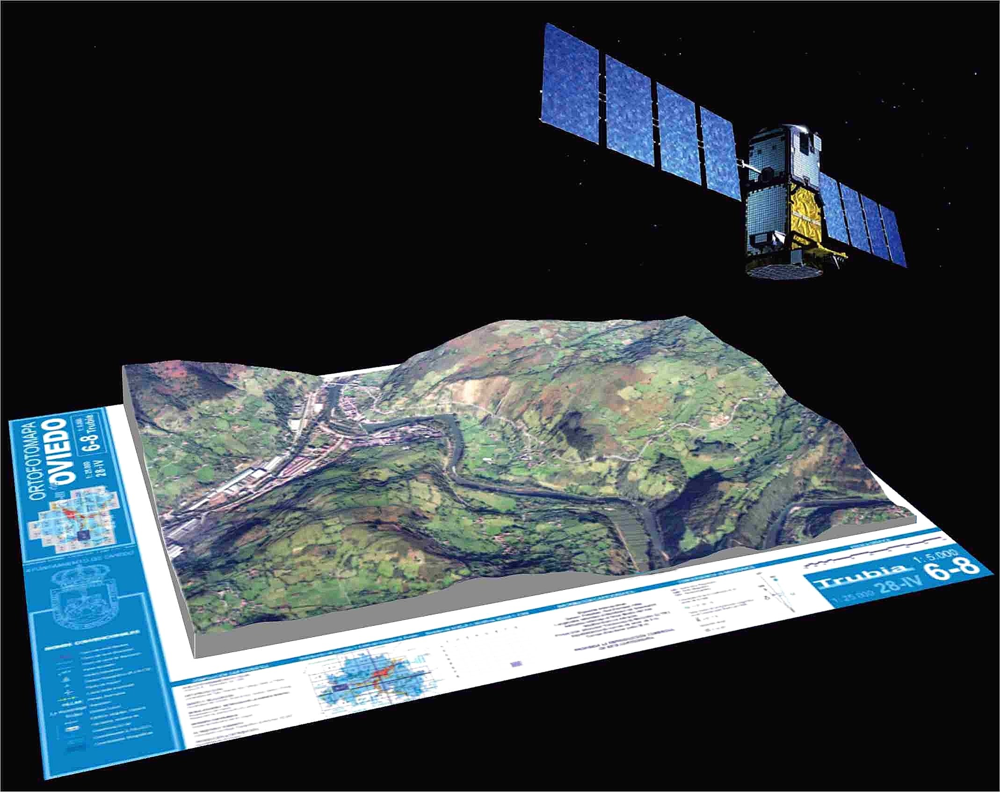

#################
\ThisCenterWallPaper{1}{geo.pdf}
\begin{tcolorbox}[colback=amarillo!30!white, sharp corners=uphill, colframe = amarillo,arc = 25mm]
\centering 
\begin{titlepage}
\begin{center}
\captionsetup[figure]{labelformat=empty}
\begin{figure}[H]
		\centering
		\includegraphics[width=0.1\linewidth]{LOGO_OUT.png}
		\caption{}
		\label{fig:Utmach}
	\end{figure}
		{\Large\textbf{Universidad Técnica de Machala}}\\\vspace{4mm}
	{\Large\textbf{Facultad de Ciencias Agropecuarias}}
	\\\vspace{5mm}
	{\Large\textbf{Carrera de Agronomía}}\\\vspace{1cm}
	\textcolor{coolblack}{\LARGE\textbf{PORTAFOLIO %\[ 1 \]%
	 }}
	\\\vspace{1cm}
	{\large\textbf{Integrantes:}}\\\vspace{1cm}
	\textcolor{coolblack}{\LARGE\textbf{	Cuenca Saquicaray Erick Fernando }}\\\vspace{0.5cm}
		\textcolor{coolblack}{\LARGE\textbf{ Guanoquiza Campoverde Lenin David}}\\\vspace{0.5cm}
	\textcolor{coolblack}{\LARGE\textbf{Loayza Zambrano Ebert Stalin }}\\\vspace{0.5cm}
		\textcolor{coolblack}{\LARGE\textbf{Morocho Carbay Alexander Darío }}\\\vspace{0.5cm}
	\textcolor{coolblack}{\LARGE\textbf{Ramos Sisalima Mayerly Estefania }}\\\vspace{0.5cm}
	\textcolor{coolblack}{\LARGE\textbf{Tejedor Pambe Sebastian Ivan }}\\\vspace{0.5cm}

	{\large\textbf{Grado:}}\\\vspace{1cm}
	\textcolor{coolblack}{\LARGE\textbf{$ 5to "B"  $  }}\\\vspace{1cm}
	
	{\large\textbf{Docente:}}\\\vspace{1cm}
	\textcolor{coolblack}{\LARGE\textbf{Ing. Agr. Angel Eduardo Luna Romero}}
	\\\vspace{0.5cm}
		\textcolor{coolblack}{\LARGE\textbf{	Mg. Sc. Recursos Hídricos}}
\end{center}
\end{titlepage}
\end{tcolorbox}


####################

\newpage
\begin{center}
{\large \textbf{Universidad Técnica de Machala}}\\
\textbf{Facultad de Ciencias Agropecuarias}\\
\textbf{Carrera de Agronomía}
\vspace{2mm}
\textbf{Geomática}
\end{center}

1. **Datos Informativos**

**Semana:** 1

**Fecha:** Pasaje, 02 de Junio 2022

**Fundamentación** 
Introducción a la Geomática

**objetivo** 

**Procedimineto**


{height=180px}
\begin{center}
{\large \textbf{Introducción a la Geomática}}\\

\end{center}
\justify
La Geomática es una ciencia que engloba las Geociencias (por ejemplo: los sistemas de información geográfica (SIG)) con la integración y aplicación de las tecnologias de la información y la comunicación (TICs) Esta integración hace posible la captura, procesamiento, análisis, interpretación, almacenamiento modelización, aplicación y difusión de información digital geoespacial o localizada, aplicable en los ámbitos de la ingenieria, el territorio y la sociedad.

{height=220px}


{height=320px}

El primer paso hacia la creación del dato geográfico implica el establecimiento de un modelo conceptual relativo a cómo se ha de interpretar la realidad geográfica. Se trata de conceptualizar el espacio estudiado, la variable tratada y la variación de esta a lo largo del espacio.

\textbf{Campos}


*Un campo es un modelo de variación dentro de un marco n-dimensional en el cual en cada punto dentro de dicho masco se tiene un valor de la variable estudiada

*La mayoria de las variables que se emplean en un SIG necesitan un único valor para describirse (piensese en variables como la elevación, la temperatura o la presión atmosérica, que solo requieren de un numero para expresarse)

\textbf{Entidades discretas}


*No asocia a cada punto geográfico un valor, sino que concibe un entorno geografico cono un espacia vacia sobre el que se sitúan distintos elementos (entidades) que lo van menando 

*Son en general más sencillas de comprender como concepto fuera de un ámbito técnico

\textbf{Conceptualización}


Los modelos geográficos nos ofrecen una concepcion particular del espacio geográfico y sus atributos. En base a ellos, el siguiente paso es reducir las propiedades de dichos modelos a un conjunto finito de elementos de tal modo que el registro de dichos elementos sirva para almacenar la realidad que los modelos geográficos describen. Para ello, empleamos los modelos de representación, también denominados modelos de datos.

{height=180px}


\textbf{Fundamentos}


Los modelos de representación definen una forma de recoger la realidad mediante unidades básicas (sean estas celdas en una malla, o bien primitivas geométricas definidas de una u otra manera), mientras que los modelos de almacenamiento plantean básicamente un esquema de cómo convertir dichas unidades en valores numéricos de la forma más eficiente. Es decir, como escribir dichos valores en un soporte digital o guardarlos en la memoria del ordenador de la mejor manera posible

\newpage
\begin{center}
{\large \textbf{Universidad Técnica de Machala}}\\
\textbf{Facultad de Ciencias Agropecuarias}\\
\textbf{Carrera de Agronomía}
\vspace{2mm}
\textbf{Geomática}
\end{center}

1. **Datos Informativos**

**Semana:** 2

**Fecha:** Pasaje, 02 de Junio 2022

**Fundamentación** 

**objetivo** 

**Procedimineto**


-Conectar directorio, primero crear carpeta dentro del disco duro, si está  fraccionado utilizar, la unidad **D**,caso contrario utilizar la unidad  **C**

**Crear una carpeta: **

*dir.create("Geomatica")*

```{r, echo=FALSE}
setwd("C:/Users/Eirck/Desktop/diarios/Fer9819.github.io")

```

-Instalar y llamar librerias
```{r}
library(pacman)
p_load(raster,sf,tidyverse,rgdal,printr)
```

**Cargar información**

```{r}
pts <- read.csv("C:/Users/Eirck/Desktop/diarios/Fer9819.github.io/DatosMuestreo.csv") %>% as_tibble()
table(pts)

```

**Pasar de tabla a dato espacial**

```{r}
pts_sf <- st_as_sf(pts, coords = c("x","y"), crs = 32717)
pts_sp <- as(pts_sf, 'Spatial')
table(pts_sf)
```

- TAMBIÉN SE PUEDE BAJAR DATOS DESDE LA WEB


```{r}
ecu <- getData("GADM", country = "ECU", level =  0 )
plot(ecu)
```

